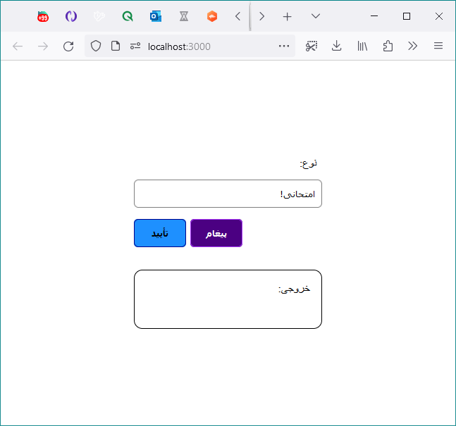

به نام او

## یه تست کوچیک!

سلام.

۴ تا تسک کوچیکه، که احتمالاً نباید کلش بیشتر از یکی دو ساعت وقت بگیره ازتون.
اگه یکی از تسک‌ها داشت زیاد وقت می‌گرفت، ازش رد بشید و بقیه رو انجام بدید.

پروژه برای استفاده با
`yarn`
کانفیگ شده، اگرچه فکر نکنم مشکلی با
`npm`
بخورید. اگه
`yarn`
ندارید، این دستور رو اجرا کنید:
`corepack enable`
(روی ویندوز احتمالاً باید داخل یه پنجره با دسترسی
administrator
اجراش کنید.)

استفاده از
VSCode و prettier
(چه از طریق اکستنشن، چه اجرای دستورش)
توصیه می‌شه.

### **یه نکته‌ی خیلی مهم**

لطفاً حتماً حتماً حتماً بعد از انجام هر تسک (یا رد شدن ازش) و قبل از این که تسک بعدی رو شروع کنید، تغییراتتون رو کامیت کنید. مهم نیست که کامیت‌ها تمیز/درست باشن، فقط مهمه که تغییرات هر تسک جدا از بقیه باشه. اگه یه تسکی رو رد کردید و دوباره برگشتید بهش، اشکالی نداره دو تا کامیت جدا از هم باشه، حتی بهتر هم هست!

بعد از این هم که کارتون تموم شد، یه جایی پوش کنید نتیجه‌ی کارتون رو، و لینکش رو برامون بفرستید.

---
---

### تسک اول

اصلاح باگ: روی دکمه‌ی «پیغام» که کلیک می‌کنیم، مقدار ورودی باید داخل پیغام نمایش داده بشه، ولی نمی‌شه.

### تسک دوم

ظاهر صفحه تا جایی که می‌تونید شبیه عکس زیر بشه.
(به کلیات و جزئیات دقت کنید. هر طور حس می‌کنید بهتر می‌شه و استاندارد‌تر هست درستش کنید.)

### تسک سوم

با کلیک روی دکمه‌ی «تأیید» دایلوگی که پیاده شده باز بشه.
(ظاهر دایلوگ رو بی‌خیالش باشید!)

با تأیید و بسته شدن دایلوگ، نوع و تعداد داخل
`div#output`
نمایش داده بشه.
(دقت کنید که قبل از تأیید دایلوگ، خروجی باید خالی باشه و فقط بعد از تأیید و بسته شدن دایلوگ باید مقادیر داخل کادر خروجی نمایش داده بشن.)

### تسک چهارم

یه کامپوننت به اسم
`CountEditor`
ساخته بشه، و این موارد به داخلش منتقل بشن:

- دکمه‌ی «تأیید» باز شدن دایلوگ
- دایلوگ
- استیت تعداد
- استیت باز بودن دایلوگ

دقت کنید که فقط دکمه‌ی «تأیید» و خود دایلوگ منتقل بشه به کامپوننت جدید، و چیز دیگه‌ای (مثل خروجی) منتقل نشه.

همه‌چیز باید مثل قبل کار کنه.
